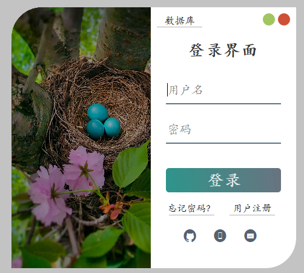
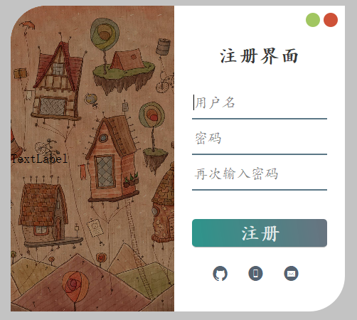
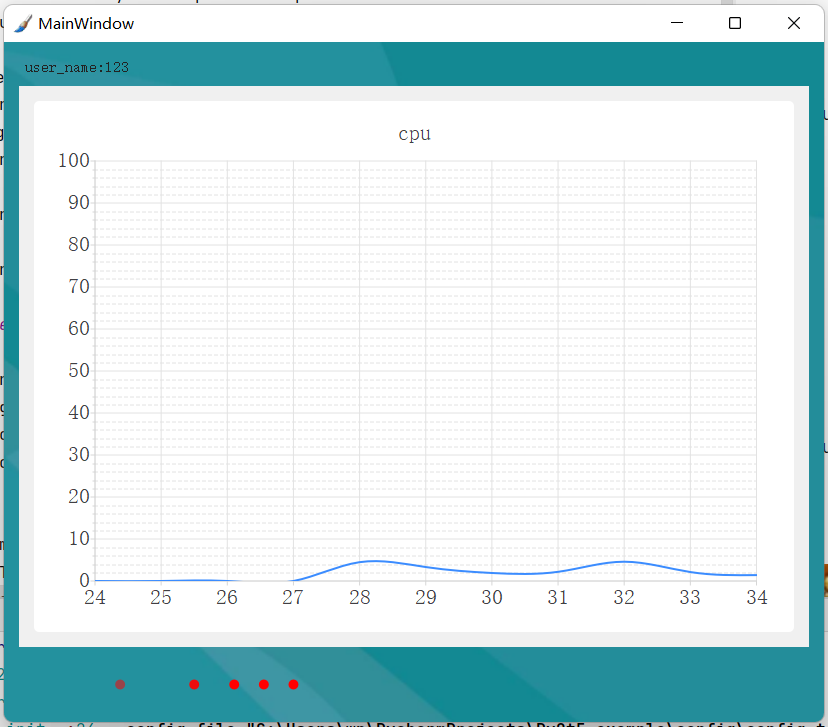
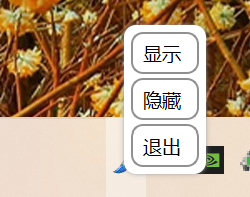

## pyqt5_example

[中文](./doc/README_zh.md)

- ✨This is an pyqt5 example🔥.
- 💻It can be used directly for rapid development.
- Some other functions will be added later, such as charts🧮.

🎯Including the software startup screen, which can be used to load the library in advance.
<div align="center"></div>
🎯Including login interface.
<div align="center"></div>
🎯Include main window. Real time display of CPU utilization.
<div align="center"></div>
🎯Includes the taskbar minimize icon.
<div align="center"></div>

## Project file structure

- doc  (Document related)
- config  (Program initialization configuration related)
    - skin  (Folder for storing skin)
    - config.toml  (configuration file)
    - core.py  (Class that handles the configuration file)
    - logs.py  (Global log display processing)
- core  (Custom UI controls)
    - MySystemTrayIcon.py  (Custom system tray icon class)
- res  (Resource folders used by programs)
    - app.qrc  (qt-designer💻Edited resource collection file)
    - app_rc.py  (Pyrcc5 converted resource file,🚫Do not modify)
- ui  (UI program folder)
    - login_form.ui  (qt-designer💻Edit UI file)
    - login_form.py  (Pyuic converted UI file,🚫Do not modify)
    - main_window.ui  (qt-designer💻Edit UI file)
    - main_window.py  (Pyuic converted UI file,🚫Do not modify)
- utils  (Folder of tool class)
    - CommonHelper.py  (Public help class)
- win  (Window logical folder)
    - splash  (Software startup screen)
    - login_form  (Login interface)
    - main_win  (main window)
- app.py  (Program entry file)
- file_verison_info.txt  (Package and modify version information🌊)
- pyqt5_example.spec  (Pyinstaller packaging🌊)
- pyqt5_example_exe.spec  (Pyinstaller packaging🌊)
- requirements.txt  (Project dependency Library)
- ui_to_py.bat
    - 💻Automatically convert UI files using pyuic and pyrcc5
    - ❗Attention to adding files in a new window
- start-qt-designer.bat
    - 💻qt-designer tool
    - ❗Pay attention to modifying the directory where the software is stored
- README.md(Project description document)

## Environmental installation

```bash
# conda creates Python virtual environment
conda create -n learn_pyqt5 python=3.8
# Activate environment
conda activate learn_pyqt5

# Installation Library
pip install -r requirements.txt

# pack
# It is packaged into many files. It is recommended to use it when it is very dependent
pyinstaller pyqt5_example.spec

# Package into a separate exe. It is recommended to use small files
# One drawback is that it will first read into memory and decompress the dependency to the cache directory. If the application is large, it is recommended to package it into a folder
pyinstaller pyqt5_example_exe.spec
```