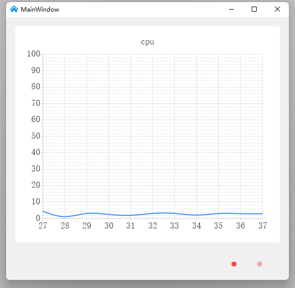
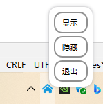

## pyqt5_example

- ✨ This is an pyqt5 example 🔥
- 💻 It can be directly used for rapid development, database connection, login and registration

🎯Including the software startup screen, which can be used to load the library in advance
<div align="center"></div>
🎯Including login interface
<div align="center"></div>
<div align="center"></div>
🎯Including the registration interface
<div align="center"></div>
🎯Including database management interface
<div align="center"></div>
🎯Including the main window, real-time display of CPU utilization
<div align="center"></div>

🎯Includes the taskbar minimize icon
<div align="center"></div>
<div align="center"></div>

## Project file structure

```sh
pyqt5_example/   # → Root
├─ doc (document related)
├─ config (program initialization configuration related)
│     │  skin (folder for storing skin)
│     └─ config.py (configuration file)
├─ core (custom control)
│     │  CpuLineChart.py (line chart showing CPU utilization, which can be improved by yourself)
│     │  DynamicSpline.py (dynamic line chart, which can be improved by yourself)
│     │  FileIconProvider.py (file icon, you can continue to improve yourself)
│     │  ImageView.py (picture viewing control, supports zooming pictures, and can continue to improve by yourself)
│     │  MetroCircleProgress.py (dynamic progress bar, stateless continuous cycle)
│     └─ MySystemTrayIcon.py (custom system tray icon class)
├─ res (resource folder used by the program)
│     │  app.qrc (qt-designer 💻 Edited resource collection file)
│     └─ app_rc.py (pyrcc5 converted resource file, 🚫 (do not modify))
├─ ui (UI folder of the program)
│     │  login_form.ui (login interface)
│     │  register_form.ui (registration interface)
│     │  mysql_form.ui (database management interface)
│     │  close_dialog.ui ((close prompt interface)
│     └─ main_window.ui (main window file)
├─ models (database related folder)
│    │  db.sql (generate database file)
│    └─ user.py (user table transaction logic)
├─ utils (folder of tool classes)
│    │  CommonHelper.py (public help class)
│    │  global_var.py (global variable class)
│    │  connect_mysql.py (connect to database)
│    └─ logs.py (Global log display processing)
├─ win (window logical folder)
│    │  splash (software startup screen, used to load the deep learning library in advance)
│    │  close_dialog.py (close the processing logic of the button prompt box)
│    │  main_win.py (logical processing of main window)
│    │  login_form.py (logical processing of login interface)
│    │  register_form.py (logical processing of registration interface)
│    └─ mysql_form.py (logical processing of database management interface)
├─ app.py (program entry file)
├─ .gitignore (git uploads ignored files)
├─ file_verison_info.txt (software version information)
├─ LICENSE (open source agreement supported by the project)
├─ pyqt5_example.spec (file packaged by pyinstaller)
├─ pyqt5_example_exe.spec (file packaged by pyinstaller)
├─ requirements.txt (project dependent Library)
├─ ui_to_py.bat
│    ├─ !Pay attention to coda environment modification
│    ├─ Start 💻 Automatically convert UI files using pyuic and pyrcc5
├─ start-qt-designer.bat
│    ├─ !Pay attention to modifying the coda environment path
│    ├─ Start 💻 QT designer tool
└─ README.md (project description document)
```

## Environmental installation

```bash
# CONDA creates Python virtual environment
conda create -n learn_pyqt5 python=3.8
# Activate environment
conda activate learn_pyqt5

# Installation Library
pip install -r requirements.txt

# Modify the MySQL server configuration information in `/config/config.py` in file

# Add a database to the database and run `/model/db.sql` file

# Pack
# It is packaged into many files. It is recommended to use it when it is very dependent
pyinstaller pyqt5_example.spec

# Package into a separate exe. It is recommended to use small files
# One drawback is that it will first read into memory and decompress the dependency to the cache directory.
# If the application is large, it is recommended to package it into a folder
pyinstaller pyqt5_example_exe.spec
```