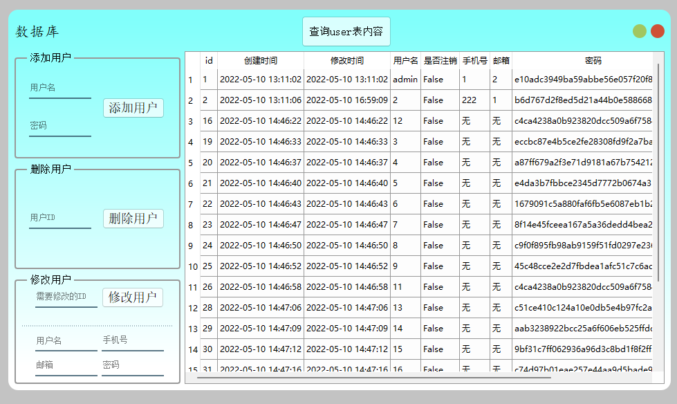

## pyqt5示例

- ✨这是一个pyqt5示例🔥
- 💻可以直接拿来快速进行开发功能，数据库连接，登录，注册功能

🎯包括了软件启动画面，可以用来提前加载库
<div align="center"></div>
🎯包括了登录界面
<div align="center"></div>
<div align="center"></div>
🎯包括了注册界面
<div align="center"></div>
🎯包括了数据库管理界面
<div align="center"></div>
🎯包括主窗口,实时显示cpu的利用率
<div align="center"></div>

🎯包括了任务栏最小化图标
<div align="center"></div>
<div align="center"></div>

## 项目文件结构

- doc (文档相关)
- config (程序初始化配置相关)
    - skin (存放皮肤的文件夹)
    - config.py (配置文件)
- core (自定义的控件)
    - CpuLineChart.py (显示cpu利用率的折线图，可以自己继续完善)
    - DynamicSpline.py (动态变化的折线图，可以自己继续完善)
    - FileIconProvider.py (文件图标，可以自己继续完善)
    - ImageView.py (图片查看控件，支持缩放图片，可以自己继续完善)
    - MetroCircleProgress.py (动态的进度条，无状态的一直循环)
    - MySystemTrayIcon.py (自定义的系统托盘图标类)
- res (程序使用的资源文件夹)
    - app.qrc (qt-designer💻编辑的资源集合文件)
    - app_rc.py (pyrcc5转换的资源文件,🚫不要修改)
- ui (程序的ui文件夹)
    - login_form.ui (登录界面)
    - register_form.ui (注册界面)
    - mysql_form.ui (数据库管理界面)
    - close_dialog.ui (关闭提示界面)
    - main_window.ui (主窗口文件)
- models (数据库相关文件夹)
    - db.sql (生成数据库文件)
    - user.py (用户表事务逻辑)
- utils (工具类的文件夹)
    - CommonHelper.py (公共帮助类)
    - global_var.py (全局变量类)
    - connect_mysql.py (连接数据库)
    - logs.py (全局的log显示处理)
- win (窗口逻辑文件夹)
    - splash (软件启动画面，用于提前加载深度学习库)
    - close_dialog.py (关闭按钮提示框的处理逻辑)
    - main_win.py (主窗口的逻辑处理)
    - login_form.py (登录界面的逻辑处理)
    - register_form.py (注册界面的逻辑处理)
    - mysql_form.py (数据库管理界面的逻辑处理)
- app.py (程序入口文件)
- .gitignore (git上传忽略的文件)
- file_verison_info.txt (软件的版本信息)
- LICENSE (项目支持的开源协议)
- pyqt5_example.spec (pyinstaller打包使用的文件)
- pyqt5_example_exe.spec (pyinstaller打包使用的文件)
- requirements.txt (项目依赖库)
- ui_to_py.bat
    - ！注意修改coda环境路径
    - 启动💻自动使用pyuic与pyrcc5转换ui文件
- start-qt-designer.bat
    - ！注意修改coda环境路径
    - 启动💻qt-designer工具
- README.md(项目说明文件)

## 环境安装

```bash
# conda创建python虚拟环境
conda create -n learn_pyqt5 python=3.8
# 激活环境
conda activate learn_pyqt5

# 安装库
pip install -r requirements.txt

# 修改mysql服务器配置信息,在 `/config/config.py` 文件中

# 数据库添加数据库,数据库中运行 `/model/db.sql` 文件

# 打包
# 打包成很多文件，建议依赖非常大的时候使用
pyinstaller pyqt5_example.spec

# 打包成单独的一个exe，建议小文件使用
# 有一个缺点，它会先读入内存，把依赖解压到缓存目录，如果应用程序大的话，建议用上面的打包成一个文件夹
pyinstaller pyqt5_example_exe.spec
```