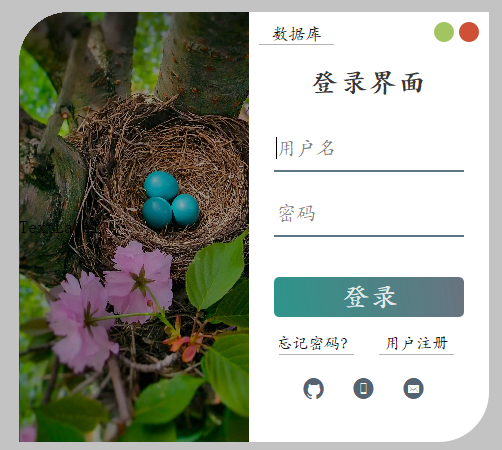

## pyqt5示例

- ✨这是一个pyqt5示例🔥
- 💻可以直接拿来快速进行开发功能
- 后期会添加一些其他功能，例如图表🧮之类

🎯包括了软件启动画面，可以用来提前加载库
<div align="center"></div>
🎯包括了登录界面
<div align="center"></div>
🎯包括主窗口,实时显示cpu的利用率
<div align="center"></div>
🎯包括了任务栏最小化图标
<div align="center"></div>

## 项目文件结构

- doc(文档相关)
- config(程序初始化配置相关)
    - skin(存放皮肤的文件夹)
    - config.toml(配置文件)
    - core.py(处理配置文件的类)
    - logs.py(全局的log显示处理)
- core(自定义的ui控件)
    - MySystemTrayIcon.py(自定义的系统托盘图标类)
- res(程序使用的资源文件夹)
    - app.qrc(qt-designer💻编辑的资源集合文件)
    - app_rc.py(pyrcc5转换的资源文件,🚫不要修改)
- ui(程序的ui文件夹)
    - login_form.ui(qt-designer💻编辑的ui文件)
    - login_form.py(pyuic转换的ui文件,🚫不要修改)
    - main_window.ui(qt-designer💻编辑的ui文件)
    - main_window.py(pyuic转换的ui文件,🚫不要修改)
- utils(工具类的文件夹)
    - CommonHelper.py(公共帮助类)
- win(窗口逻辑文件夹)
  - splash(软件启动画面)
  - login_form(登录界面)
  - main_win(主窗口)
- app.py(程序入口文件)
- file_verison_info.txt(打包修改版本信息🌊)
- pyqt5示例.spec(pyinstaller打包🌊)
- pyqt5示例_exe.spec(pyinstaller打包🌊)
- requirements.txt(项目依赖库)
- ui_to_py.bat
  - 💻自动使用pyuic与pyrcc5转换ui文件
  - ❗新建窗口的注意添加文件
- 启动qt-designer.bat
  - 💻qt-designer工具
  - ❗注意修改软件存放的目录
- README.md(项目说明文件)

## 环境安装
```bash
# conda创建python虚拟环境
conda create -n learn_pyqt5 python=3.8
# 激活环境
conda activate learn_pyqt5

# 安装库
pip install -r requirements.txt

# 打包
# 打包成很多文件，建议依赖非常大的时候使用
pyinstaller pyqt5_example.spec

# 打包成单独的一个exe，建议小文件使用
# 有一个缺点，它会先读入内存，把依赖解压到缓存目录，如果应用程序大的话，建议用上面的打包成一个文件夹
pyinstaller pyqt5_example_exe.spec
```